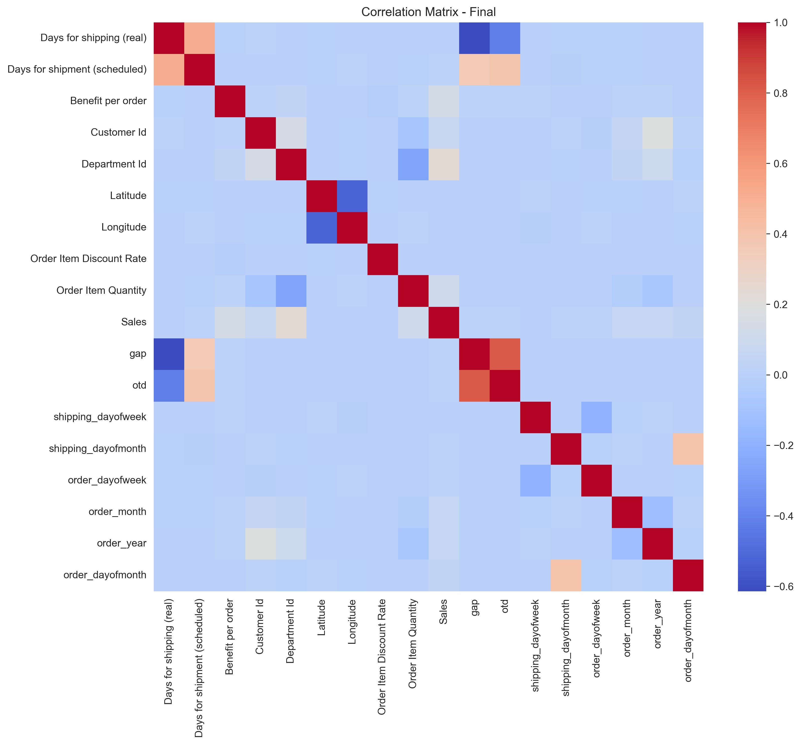
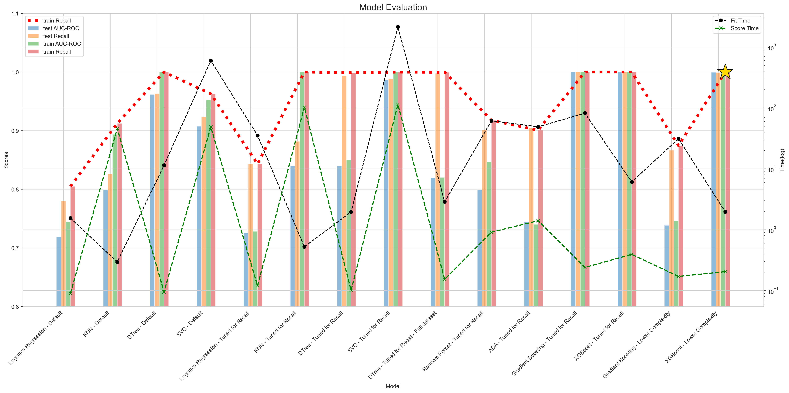
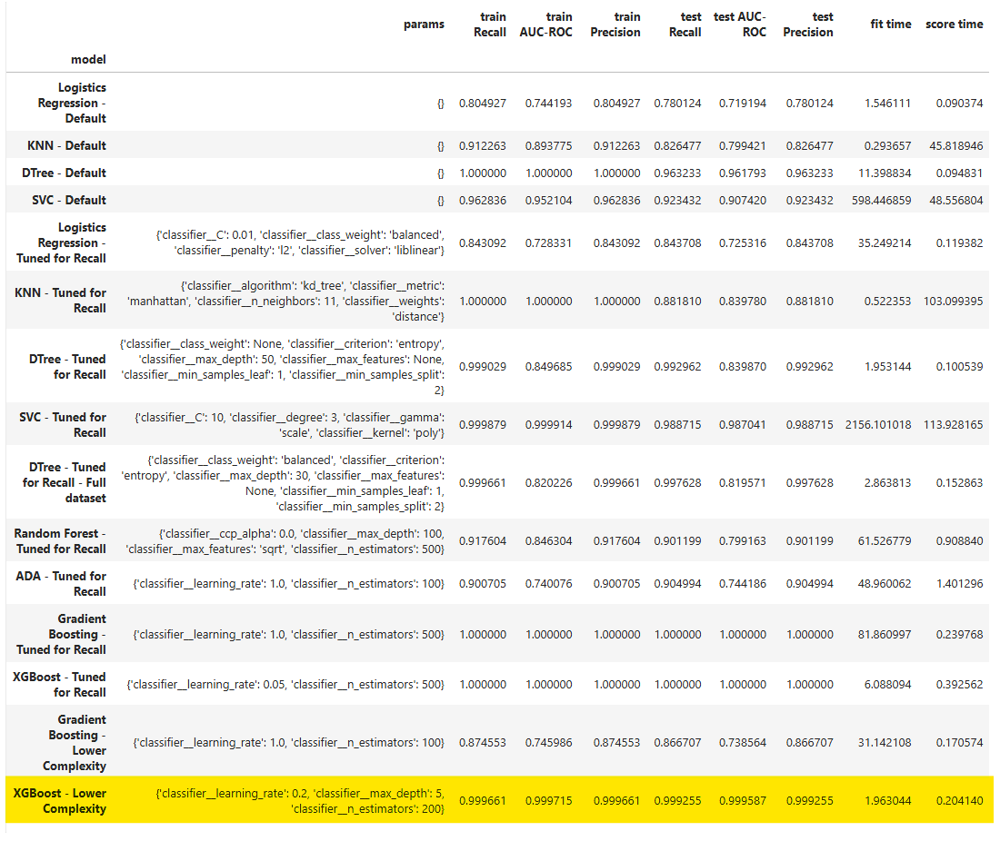
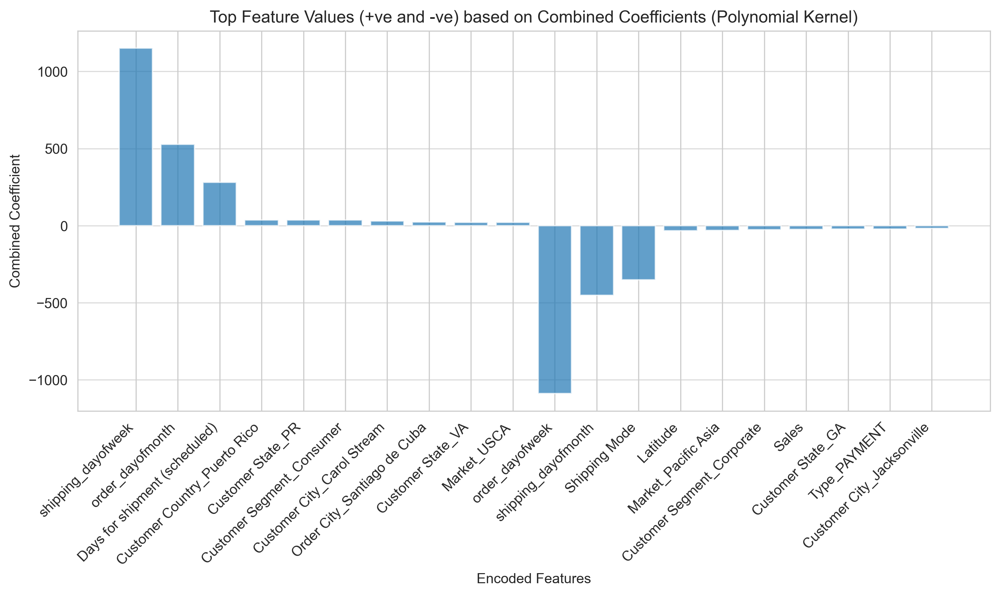

# Will this order be delivered on time? 
#### Jupyter Notebook with detailed analysis [here](https://github.com/nikhilmadhu/otd/blob/main/src/Capstone_OTD.ipynb)

## Business Goal
In today's interconnected, globalized economy with supply chains and shipping routes spanning across the globe, the ability to accurately deliver an order at the promised time is paramount to customer satisfaction. This is tracked by a metric called On Time Delivery (OTD). Ability to predict OTD misses and take appropriate corrective actions would be beneficial to brand image, customer satisfaction and in turn, higher customer retentions and more orders, which would increase sales and profits!

For this specific analysis, We will explore how 'Days of Shipping(real)' and 'Days of Shipping(Scheduled)' are related and create a model to predict if the Real shipment time will match the scheduled value or not.

This could be approached in two  ways - 
1. Consider 'Days of shipping(real)' as a real value and apply regression techniques to predict the scheduled Days of shipping value to be as close to the real one as possible
2. Consider the difference between the the Real and Scheduled Days of shipping and model this a a bianry problem to predict Yes/No for met/not-not met sceanrios, making this a Classification problem
   
For the purposes of this analysis, we will take the second path and model this as a yes/no question that would provide insights to the operations/logistcs team if there is a lurking danger of missing OTD on a particualr order (Even before the shipping process has started) and enable them to take corrective actions. We will only consider Late deliveries as 'missed' and treat early deliveries as 'met'. 

In subsequent iterations, we could add additional analysis and models to predict 'Early' scenarios as well as come up with a prediction model to predict expected shipping times for orders.

## Actionable Insights from the Analysis
#### Investigate Seasonal Trends
January and December show a higher rate of OTD misses, likely due to increased shipping volumes and potential delays around the holidays. Consider adjusting shipping times and methods during these peak seasons to mitigate this issue.
#### Address End-of-Month Shipping Challenges
Orders shipped or placed on the last day of the month appear to be more susceptible to OTD misses.  Further investigation is needed to understand the factors contributing to this trend and implement appropriate solutions.
#### Re-evaluate Shipping Modes

  
Impact of Shipping operations

   

First and Second Class shipping modes are underperforming and lead to a significant number of missed OTD targets. While Same Day shipping performs better, it still misses OTD almost 50% of the time. A thorough review of shipping mode options and their reliability is necessary to improve OTD performance.

#### Re-evaluate Shipping time estimation rules, carrier performance and any other logistical challenges for

  
Impact of location

   

##### Customer City
- Orders to Customer cities 'Fairfield', 'Algonquin', 'Stockton' are often delayed
##### Order Location 
- On-Time Delivery (OTD) targets are consistently missed for orders placed in these cities: 'Villeurbanne', 'San Francisco de Macorís', 'Pirapora' and 'Apopa'
- Additionally, orders shipped to the state of Tamaulipas show a higher likelihood of OTD misses.

## Data
This data is courtsey of Constante, Fabian; Silva, Fernando; Pereira, António (2019), “DataCo SMART SUPPLY CHAIN FOR BIG DATA ANALYSIS”, Mendeley Data, V5, doi: 10.17632/8gx2fvg2k6.5 available [here](https://data.mendeley.com/datasets/8gx2fvg2k6/3) and I offer my sincere gratitude to the team for making this data available in the public domain. It has ~180K samples with 50 features 
#### Contents: 

  
Fields & descriptions

   
| FIELDS | DESCRIPTION |
|---|---|
| Type | Type of transaction made |
| Days for shipping (real) | Actual shipping days of the purchased product |
| Days for shipment (scheduled) | Days of scheduled delivery of the purchased product|
| Benefit per order | Earnings per order placed |
| Sales per customer | Total sales per customer made per customer |
| Delivery Status | Delivery status of orders: Advance shipping, Late delivery, Shipping canceled, Shipping on time |
| Late_delivery_risk | Categorical variable that indicates if sending is late (1), it is not late (0) |
| Category Id | Product category code |
| Category Name | Description of the product category |
| Customer City | City where the customer made the purchase |
| Customer Country | Country where the customer made the purchase |
| Customer Email | Customer's email |
| Customer Fname | Customer name | 
| Customer Id | Customer ID |
| Customer Lname | Customer lastname |
| Customer Password | Masked customer key |
| Customer Segment | Types of Customers: Consumer, Corporate, Home Office |
| Customer State | State to which the store where the purchase is registered belongs |
| Customer Street | Street to which the store where the purchase is registered belongs |
| Customer Zipcode | Customer Zipcode |
| Department Id | Department code of store |
| Department Name | Department name of store |
| Latitude | Latitude corresponding to location of store |
| Longitude | Longitude corresponding to location of store |
| Market | Market to where the order is delivered: Africa, Europe, LATAM, Pacific Asia, USCA |
| Order City | Destination city of the order |
| Order Country | Destination country of the order |
| Order Customer Id | Customer order code |
| order date (DateOrders) | Date on which the order is made |
| Order Id | Order code |
| Order Item Cardprod Id | Product code generated through the RFID reader |
| Order Item Discount | Order item discount value |
| Order Item Discount Rate | Order item discount percentage |
| Order Item Id | Order item code |
| Order Item Product Price | Price of products without discount |
| Order Item Profit Ratio | Order Item Profit Ratio |
| Order Item Quantity | Number of products per order |
| Sales | Value in sales |
| Order Item Total | Total amount per order |
| Order Profit Per Order | Order Profit Per Order |
| Order Region | Region of the world where the order is delivered: Southeast Asia, South Asia, Oceania, Eastern Asia, West Asia, West of USA, US Center, West Africa, Central Africa, North Africa, Western Europe, Northern, Caribbean, South America, East Africa, Southern Europe, East of USA, Canada, Southern Africa, Central Asia, Europe, Central America, Eastern Europe, South of USA |
| Order State | State of the region where the order is delivered |
| Order Status | Order Status: COMPLETE, PENDING, CLOSED, PENDING_PAYMENT, CANCELED, PROCESSING, SUSPECTED_FRAUD, ON_HOLD, PAYMENT_REVIEW |
| Product Card Id | Product code |
| Product Category Id | Product category code |
| Product Description | Product Description |
| Product Image | Link of visit and purchase of the product |
| Product Name | Product Name |
| Product Price | Product Price |
| Product Status | Status of the product stock: If it is 1 not available, 0 the product is available |
| Shipping date (DateOrders) | Exact date and time of shipment |
| Shipping Mode | The following shipping modes are presented: Standard Class, First Class, Second Class, Same Day |

The data was of good quality with very few missing records

  
Initial Quality of Data

   
|Column Name|Type|Null Count|Unique Count|Null %|
|---|---|---|---|---|
|Type|object|0|4|0.00|
|Days for shipping (real)|int64|0|7|0.00|
|Days for shipment (scheduled)|int64|0|4|0.00|
|Benefit per order|float64|0|21998|0.00|
|Sales per customer|float64|0|2927|0.00|
|Delivery Status|object|0|4|0.00|
|Late delivery risk|int64|0|2|0.00|
|Category Id|int64|0|51|0.00|
|Customer City|object|0|563|0.00|
|Customer Country|object|0|2|0.00|
|Customer Id|int64|0|20652|0.00|
|Customer Segment|object|0|3|0.00|
|Customer State|object|0|46|0.00|
|Customer Street|object|0|7458|0.00|
|Customer Zipcode|float64|3|995|0.00|
|Department Id|int64|0|11|0.00|
|Latitude|float64|0|11250|0.00|
|Longitude|float64|0|4487|0.00|
|Market|object|0|5|0.00|
|Order City|object|0|3597|0.00|
|Order Country|object|0|164|0.00|
|order date (DateOrders)|object|0|65752|0.00|
|Order Item Cardprod Id|int64|0|118|0.00|
|Order Item Discount|float64|0|1017|0.00|
|Order Item Discount Rate|float64|0|18|0.00|
|Order Item Product Price|float64|0|75|0.00|
|Order Item Profit Ratio|float64|0|162|0.00|
|Order Item Quantity|int64|0|5|0.00|
|Sales|float64|0|193|0.00|
|Order Item Total|float64|0|2927|0.00|
|Order Profit Per Order|float64|0|21998|0.00|
|Order Region|object|0|23|0.00|
|Order State|object|0|1089|0.00|
|Order Status|object|0|9|0.00|
|Order Zipcode|float64|155679|609|86.24|
|Product Card Id|int64|0|118|0.00|
|Product Category Id|int64|0|51|0.00|
|Product Price|float64|0|75|0.00|
|Product Status|int64|0|1|0.00|
|shipping date (DateOrders)|object|0|63701|0.00|
|Shipping Mode|object|0|4|0.00|
|gap|int64|0|7|0.00|
|otd|int64|0|2|0.00|

#### The data has ~60/40 split

### Feature Engineering
#### The following adjustments were done to improve data quality:
1. Remove Features / Samples
>> - Order Id, Order Customer Id, Order Item Id : Key columns that do not add any value to the analysis
>> - Category Name : Co-rrelated to Category Id
>> - Customer Email, Customer Fname, Customer Lname, Customer Password : Co-rrelated to Customer Id
>> - Department Name : Co-rrelated to Department Id
>> - Product Image, Product Name, Product Description: Co-rrelated to Product Card Id
>> - Order Zip code has a large amount of null. This would be removed
>> - There are three records with Customer zip as Null. Remove those rows as well
2. Feature Engineering
>> - shipping date (DateOrders), order date (DateOrders). Split into epoch, day of week, week of year, month and year

#### With the base adjustment, the features were organized as follows:

  
Categorical Features

   

  
Numerical Features

   

 

  
Correlation between Features

   

 

#### After evaluating these, the following actions were taken  
>> - 'product status' feature was always 0. Remove it
>> - Order Dates and Shipping dates have very high correlation. Further, the month and weeks have high correlation as well. Hence, dropping those. Further, Order with 'Shipping Cancelled' status should be removed to not skew the shipping results
>> - 'Category Id', 'Department Id', 'Product Category Id', 'Product Card Id' and 'Order Item Cardprod Id' have high positive correlation. To reduce computation, will only keep the 'Department Id' and drop the others
>> - 'Order Item Total' has very high correlation with 'Product Price' and 'Sales per customer'. Only 'Product Price Benefit per order' will be kept
>> - 'Order Profit Per Order' and 'Order Item Profit Ratio' are highly correlated. Will keep only the latter
>> - 'Order Item Product Price' and 'Product Price' are highly correlated. Keeping only the latter here as well
>> - 'Order Item Quantity' and 'Product price' have a very high inverse relationship. Will keep 'Order Item Quantity'
>> - 'Order Item Discount' and 'Order Item Discount Rate' have high correlation. Only keeping the latter
>> - 'Late Delivery Risk' and 'Gap' have high correlation, and it looks like it is captured based on actual shipping data. Hence, removing it
>> - 'Customer Zip Code' and 'longitude/latitude' have a very high correlation. Removing the former

#### and after these adjustements, the final set of features were arrived at

  
Final Data & Quality
  
   
|Column Name|Type|Null Count|Unique Count|Null %|
|---|---|---|---|---|
|Type|object|0|4|0.0|
|Days for shipping (real)|int64|0|7|0.0|
|Days for shipment (scheduled)|int64|0|4|0.0|
|Benefit per order|int32|0|1273|0.0|
|Customer City|object|0|562|0.0|
|Customer Country|object|0|2|0.0|
|Customer Id|int64|0|20258|0.0|
|Customer Segment|object|0|3|0.0|
|Customer State|object|0|44|0.0|
|Department Id|int64|0|11|0.0|
|Latitude|int32|0|28|0.0|
|Longitude|int32|0|64|0.0|
|Market|object|0|5|0.0|
|Order City|object|0|3585|0.0|
|Order Country|object|0|164|0.0|
|Order Item Discount Rate|float64|0|18|0.0|
|Order Item Quantity|int64|0|5|0.0|
|Sales|int32|0|126|0.0|
|Order Region|object|0|23|0.0|
|Order State|object|0|1083|0.0|
|Order Status|object|0|7|0.0|
|Shipping Mode|object|0|4|0.0|
|gap|int64|0|7|0.0|
|otd|int64|0|2|0.0|
|shipping_dayofweek|int32|0|7|0.0|
|shipping_dayofmonth|int32|0|31|0.0|
|order_dayofweek|int32|0|7|0.0|
|order_month|int32|0|12|0.0|
|order_year|int32|0|4|0.0|
|order_dayofmonth|int32|0|31|0.0|

The relationship between various features were as follows:

  
Final Correlation matrix 
  
   

## Modeling
As the dataset is fairly large, we will run the intial modeling against 50% of the dataset (for computational efficiencies) and then do the final set of training and optimization with the full dataset

As the final goal is to ensure that the model is able to predict OTD-NotMet cases effectively, we will focus on **Recall** of the model as we need negative cases to be identified efficiently.

GridSearchCV was used to evaluate the performance of various combinations of **Recall** followed by AUC/ROC metric to identify a good model from the following base models -
1. KNeighborsClassifier
2. DecisionTreeClassifier
3. LogisticRegression
4. SVC (Support Vector Machine based classifier)
   
and, then, the  following Enseble models -
1. RandomForestClassifier
2. GradientBoostingClassifier
3. AdaBoostClassifier
4. XGBClassifier (from XGBoost)
   
The data was scaled using standard scaler and encoded using one hot encoder. Further, care was taken to ensure the slight imbalance of data was properly managed by the models by setting the appropriate hyperparameters.

### Analysis

  
Analysis of Base Models
 
   
#### Best Base Model
Model Name: SVC - Tuned for Recall \
Params: {'classifier__C': 10, 'classifier__degree': 3, 'classifier__gamma': 'scale', 'classifier__kernel': 'poly'} \
**Train Recall: 0.999879** \
**Test Recall : 0.988715** 

The model has excellent recall abilities and excellent class separation abilities as shown here

Based on permutation importance as well as SVM coefficient analysis, the most important and impactful feature values are as follows:
1. Important Features

2. Impact of Features / Categorical Values

   
### Best Model with Ensemble techniques
Model Name: XG Boost - Lower Complexity \
Params: {'classifier__learning_rate': 0.2, 'classifier__max_depth': 5, 'classifier__n_estimators': 200} \
**Train Recall: 0.999661** \
**Test Recall : 0.999255** 

The model has excellent recall abilities and excellent class separation abilities as shown here, along with much better fit and acore times as compared to the best SVC based model

Based on permutation importance as well as XGBoost's coefficient analysis, the most important and impactful feature values are as follows:
1. Important Features

2. Impact of Features / Categorical Values

### Deployment
The top-performing model is selected for deployment. It's packaged using joblib and exposed as an API using the FastAPI framework (see the workbook for implementation details). To streamline the deployment process, MLflow is recommended for building a robust pipeline.

### Next Steps
#### Ongoing Monitoring and Refinement
As new data becomes available, it's crucial to continuously fine-tune the model to maintain its accuracy and ensure it remains free from bias. Regular evaluations and adjustments should be incorporated into the model's lifecycle.

#### Future Enhancement: Predictive Shipping Time
To further reduce On-Time Delivery (OTD) misses, consider developing a regression model that predicts optimal scheduled shipping times. This proactive approach could provide more accurate delivery estimates and help prevent delays before they occur.

